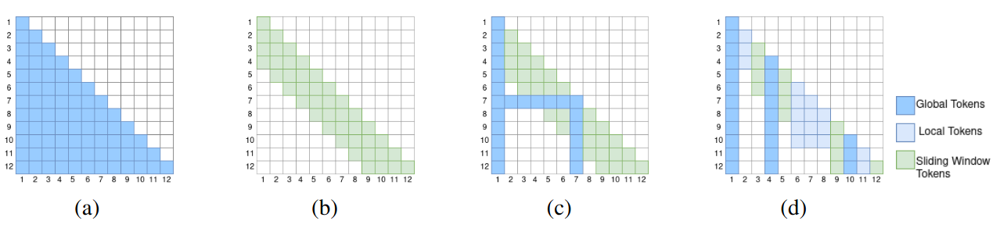
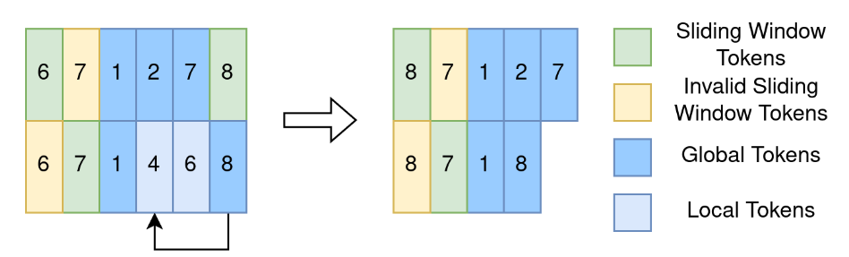
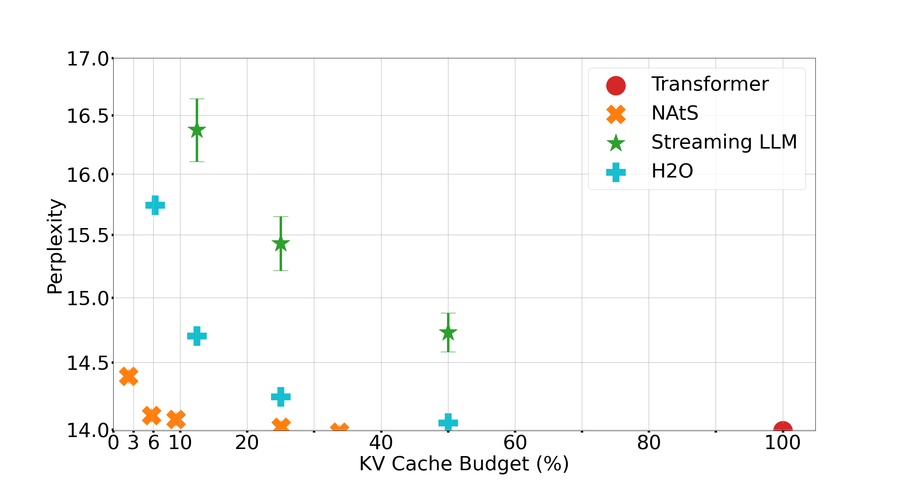
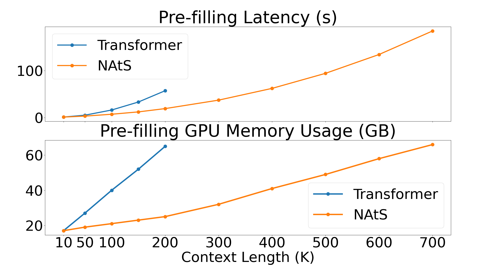
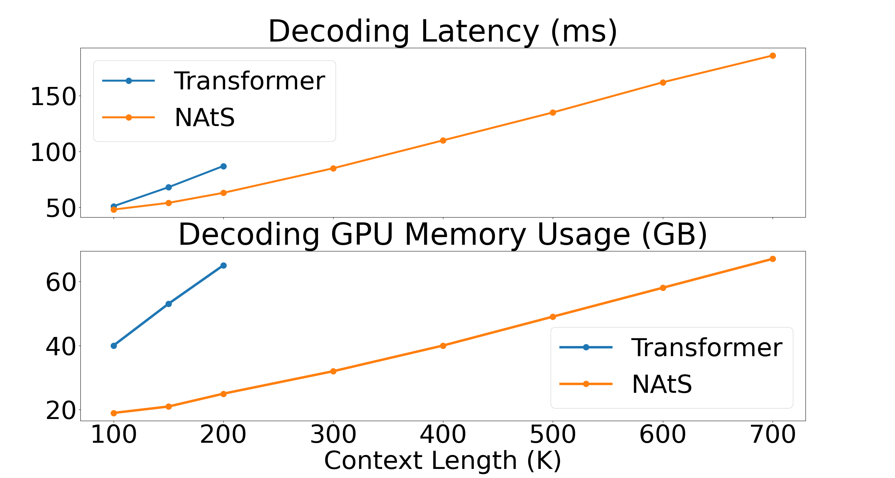

# Neural Attention Search (NAtS)


This repository contains the codes for the paper [Neural Attention Search](https://arxiv.org/abs/2502.13251). 




NAtS is an end-to-end learnable sparse transformer model. 
Unlike transformers with sliding window attention (b) or Longformer (c) that defines global tokens within the fixed positions. 
NAtS learns the importance of each token automatically and assign different roles to each token.



Tokens that are considered as less important will be removed from the KV cache, 
thus reducing the over inference time and memory consumption with minimal performance loss


<p float="right">
 

</p>


To train a new nats model from scratch, please run the following commands:
```
cd experiments
python train.py model.base_dir=\YOUR\PATH\TO\SAVE\MODEL n_gpus=4 dataset.base_dir=\YOUR\PATH\TO\DATASET transformer_args.nats_enable=True
```
Then you could evaluate the nats model with
```
cd experiments
python eval.py model.base_dir=\YOUR\PATH\TO\SAVE\MODEL n_gpus=1 dataset.base_dir=\YOUR\PATH\TO\DATASET transformer_args.nats_enable=True
```

To fine-tune the dataset, first you need to generate the fine tuning training dataset from LongBench.
Some of the datasets are from huggingface, while the other datasets need to be collected manually:
```
http://curtis.ml.cmu.edu/datasets/hotpot/hotpot_train_v1.1.json
https://github.com/StonyBrookNLP/musique
https://github.com/baidu/DuReader/tree/master/DuReader-2.0
https://gov-report-data.github.io/
https://github.com/Yale-LILY/QMSum
https://github.com/hahahawu/VCSum
https://github.com/Leolty/repobench
```
And the synthetic dataset
```
https://huggingface.co/datasets/togethercomputer/Long-Data-Collections/resolve/main/fine-tune/booksum.jsonl.zst
```
Once all the dataset is downloaded, please run: 
```
cd experiments/finetune_datasets
python prepare_longbench_train_data.py  --long_bench_dataset_path \PATH\TO\THE\DOWNLOADED\DATASET \
                                        --dataset YOURDATASET \ 
                                        --res_dir \PATH\THAT\YOU\WOULD\LIKE\TO\STORE\THE\DATA \
                                        --tokenizer_path \LLM\PATH
```
and then download the synethetic dataset towards 
```
cd \PATH\THAT\YOU\WOULD\LIKE\TO\STORE\THE\DATA
wget https://huggingface.co/datasets/togethercomputer/Long-Data-Collections/resolve/main/fine-tune/booksum.jsonl.zst
```
Now you could fine tune a model on the generated dataset (we currently support Llama and Mistral model families)
by customizing the corresponding configurations under `experiments/configs/finetune_distill`
```
cd experiments
python hf_finetune_longbench.py 
```

and evaluate on the long-bench dataset:
```
cd experiments/long_bench
pyhton hf_pred.py --nats_enable --adapter_path \THE\ADAPTER\PATH 
```

# Our paper
The detailed information can be found in our paper:

```
@article{deng2025neuralattentionsearch,
      title={Neural Attention Search}, 
      author={Difan Deng and Marius Lindauer},
      booktitle = {Proceedings of the 39th International Conference on Advances in Neural Information Processing Systems (NeurIPS'25)},
      year      = {2025}
}
```
